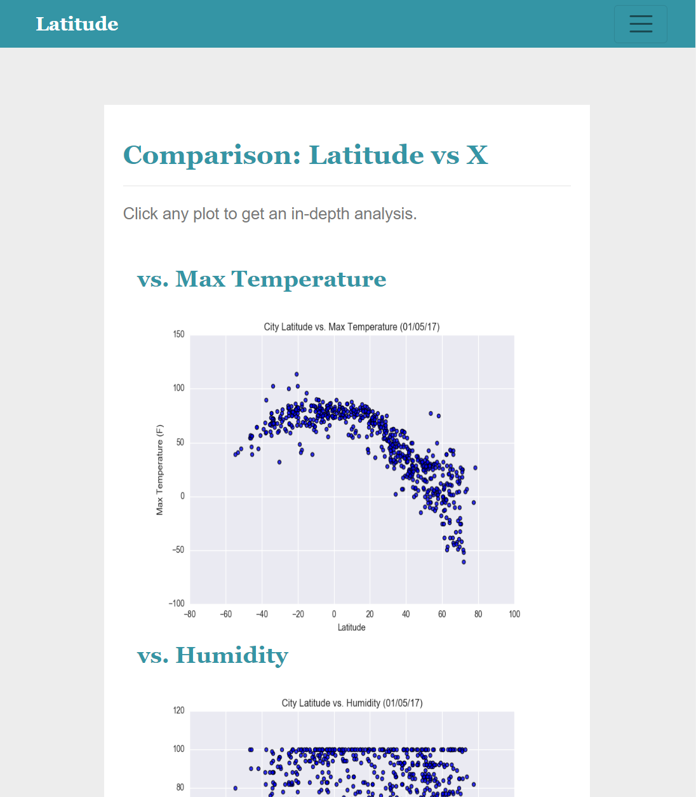

# web-design-challenge: Weather Visualization Dashboard
Based on images generated from the [cities dataset](Resources/cities.csv), a [website](https://sbowe1.github.io/web-design-challenge/index.html) was created to illustrate the findings. The Github Pages website is written primarily in HTML and further stylized in CSS. To make the website more accessible, the layout and navigation bar displayes were altered for screen widths under 992 pixels. 

## Landing Page
The landing page provides a summary of the project, as well as links to each of the four visualization pages. Images can clicked to redirect the user to the appropriate page.

| Normal Display | Small Display |
| -------------- | ------------- |
|  | 

## Visualization Pages
Each visualization page contains a title and plot with its explanation. The other visualization pages can also be accessed from this page by clicking on their image. 

The screenshots below highlight the navigation bar feature, which includes links to all of the pages available. The visualization pages are found within the "Plots" dropdown. 

| Normal Display | Small Display |
| -------------- | ------------- |
|  | 

## Comparisons Page
The comparison page shows all four of the visualizations on one page, either in a 2x2 grid or linewise, depending on the screen size. 

| Normal Display | Small Display |
| -------------- | ------------- |
|  | 

## Data Page
The data page consisits of the original dataset, depicted in a table.

| Normal Display | Small Display |
| -------------- | ------------- |
|  | 
